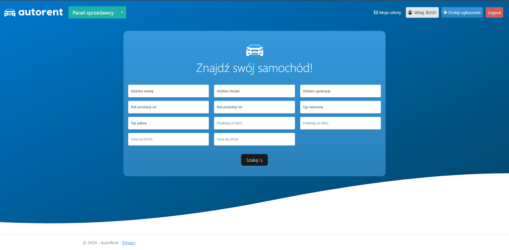
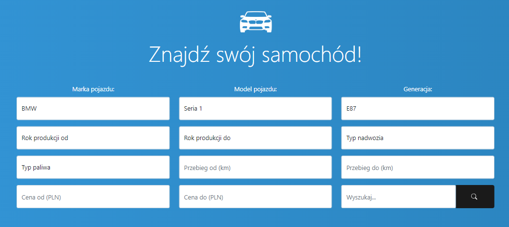
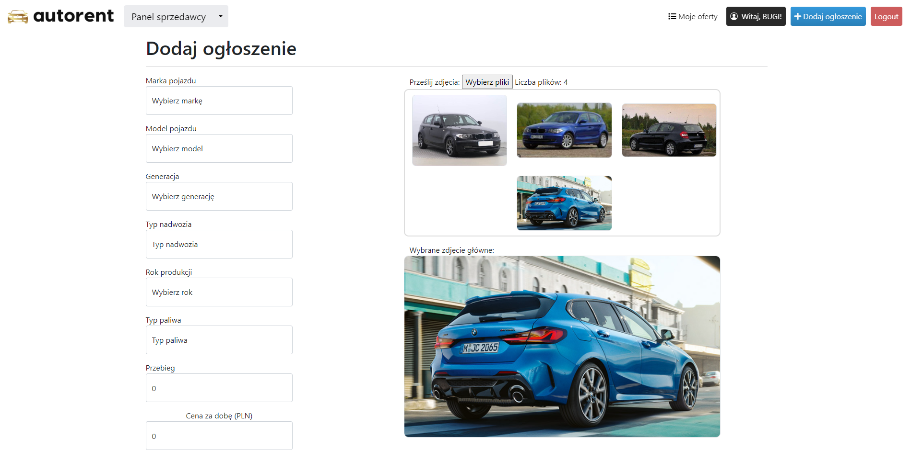
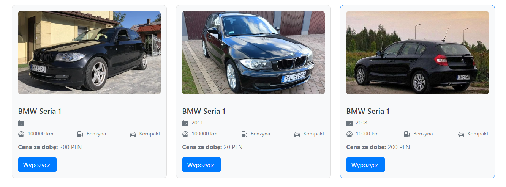
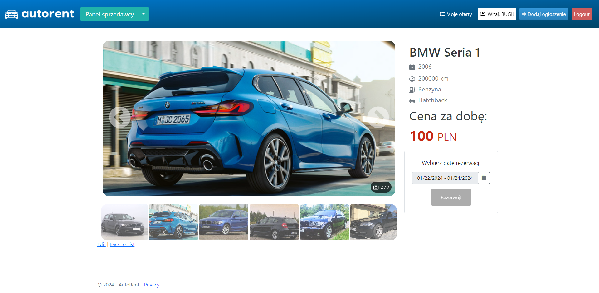
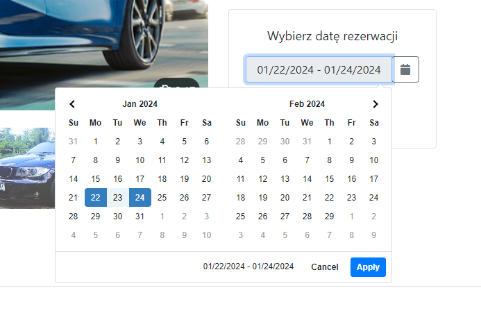
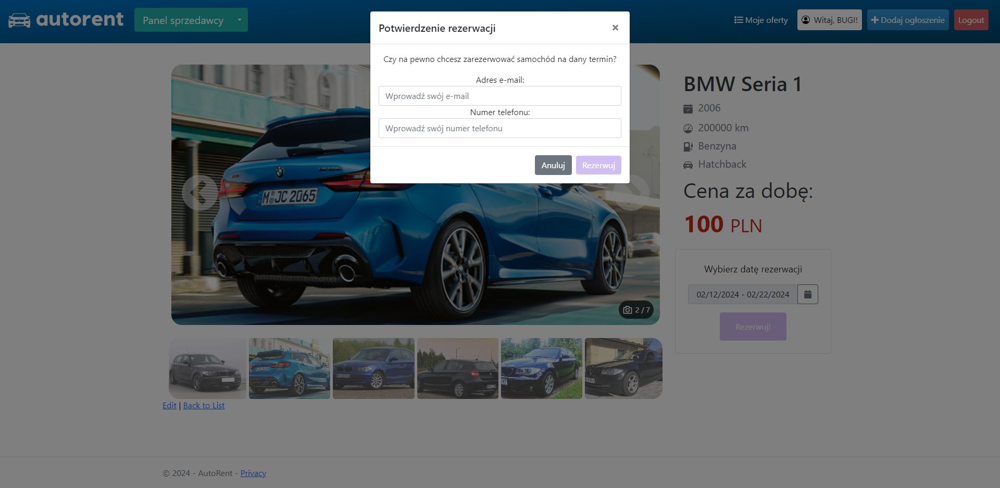
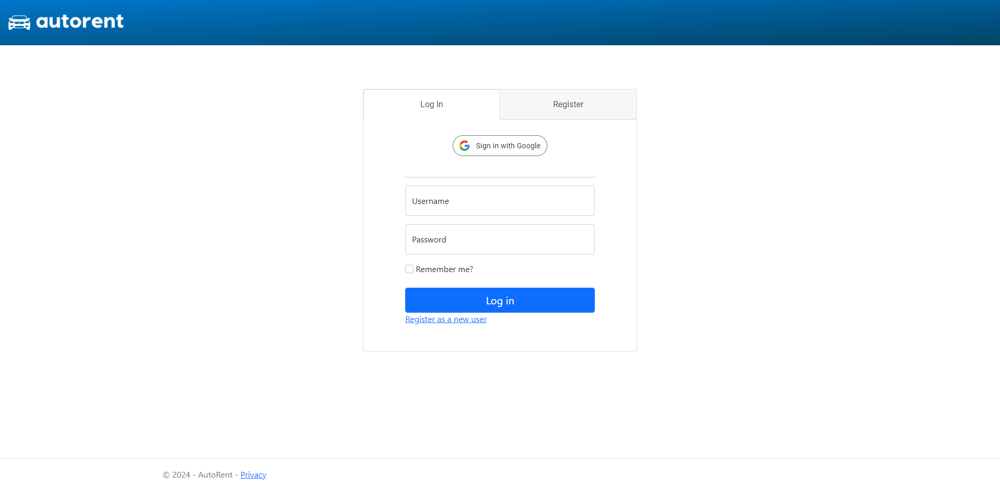

# AutoRent - Car Rental Platform 🚗

Welcome to AutoRent, a web application that serves as a car rental platform, allowing users to list their cars for rent and make reservations. It's your go-to online car rental hub where anyone can showcase their vehicles.

## Gallery

<details open>
  <summary>Main Dashboard</summary>
  
  
</details>

<details>
  <summary>Filter Form</summary>
  
  
</details>

<details>
  <summary>Add a Car Ad</summary>
  
  
</details>

<details>
  <summary>Car Ads List</summary>
  
  
</details>

<details>
  <summary>Car Ad Details</summary>
  
  
</details>

<details>
  <summary>Event Calendar</summary>
  
  
</details>

<details>
  <summary>Reservation Form</summary>
  
  
</details>

<details>
  <summary>Login Screen</summary>
  
  
</details>


## Features 🌟

- **Responsive Design** 📱: Utilizing Bootstrap for a responsive, functional, and modern look.
- **Identity Integration** 🔐: Users can create accounts and log in. Unauthenticated users can browse and view car details, while additional features are accessible only to logged-in users.
- **User Roles** 👤: Distinct views for sellers and customers in the logged-in state.
- **Google Authentication** 🌐: Sign up or log in using Google via API integration.
- **Entity Framework** 🔄: Database operations are handled efficiently with Entity Framework.
- **Dynamic Filtering** 🎯: Users can filter cars using a form on the homepage.
- **Ad Management** 📝: Sellers can add, edit, and manage their car listings.
- **Reservation System** 🗓️: Customers can reserve cars for specific dates.
- **Reservation and Listing Views** 👀: Users can view their reservations and listings separately.

## Getting Started 🚀

Follow these steps to run the application using Visual Studio:

1. **Clone the Repository**:
   - Open a terminal.
   - Run:
     ```bash
     git clone https://github.com/m-bugaj/Car-Rental-Hub.git
     ```

2. **Open Solution in Visual Studio**:
   - Launch Visual Studio.
   - Open the `CarRentalHub.sln` solution file.

3. **NuGet Packages**:
   - Restore NuGet packages for the solution.

4. **Update Database**:
   - Open Package Manager Console (Tools -> NuGet Package Manager -> Package Manager Console).
   - Run the following commands to apply migrations and update the database:
     ```bash
     Add-Migration InitialMigration -Context CarRentalHubContext
     Update-Database -Context CarRentalHubContext
     Add-Migration InitialMigration -Context PhotoContext
     Update-Database -Context PhotoContext
     # Repeat for FilterDataContext and CarAvailabilityContext
     ```

5. **Update FilterData Table**:
   - Update the FilterData table in the database with car brands, models, and generations.

6. **Run the Application**:
   - Press `F5` or use the "Start Debugging" button to run the application.

7. **Access the Application**:
   - Open your web browser and go to `https://localhost:{YOUR_LOCAL_PORT}`.

## Future Enhancements 🚀

In the future, I plan to add real-time chat functionality between sellers and customers. Additionally, a map feature will be introduced to narrow down search results based on locations.

Feel free to contribute or provide feedback for the continuous improvement of AutoRent! 🚗✨
